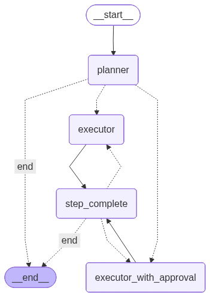

# Chat Automation

AI-powered chat automation platform with an Express API, Next.js frontend, and a LangGraph-based Python agent with MCP tool integrations.



## Architecture

| Service      | Tech                                      | Port   |
| ------------ | ----------------------------------------- | ------ |
| **Web**      | Next.js 16, React 19, TailwindCSS         | `3000` |
| **API**      | Express 5, tRPC, Passport.js, Prisma, JWE | `8000` |
| **Agent**    | FastAPI, LangGraph, LangChain, MCP        | `8001` |
| **Database** | PostgreSQL 16                             | `5432` |
| **Proxy**    | Nginx                                     | `8080` |

```
┌──────────────────────────────────────────────────┐
│                   Nginx (:8080)                  │
│                                                  │
│   /          → Web (:3000)                       │
│   /auth/*    → API (:8000)                       │
│   /trpc/*    → API (:8000)                       │
│   /oauth/*   → API (:8000)                       │
│   /agent/*   → Agent (:8001)                     │
└──────────────────────────────────────────────────┘
```

---

## Quick Start

### 1. Prerequisites

- **Docker** & Docker Compose

### 2. Setup Environment

```bash
cp .env.example .env
```

Generate a session secret and fill in the required values:

```bash
openssl rand -base64 32   # paste this as SESSION_SECRET
```

Required values in `.env`:

| Variable | Where to get it |
|---|---|
| `SESSION_SECRET` | Run `openssl rand -base64 32` |
| `GOOGLE_CLIENT_ID` | [Google Cloud Console](https://console.cloud.google.com/apis/credentials) |
| `GOOGLE_CLIENT_SECRET` | [Google Cloud Console](https://console.cloud.google.com/apis/credentials) |
| `GOOGLE_API_KEY` | [Google AI Studio](https://aistudio.google.com/) |
| `TAVILY_API_KEY` | [Tavily](https://tavily.com/) |

### 3. Google Cloud Console Setup

1. Go to [APIs & Services → Credentials](https://console.cloud.google.com/apis/credentials)
2. Create or select an **OAuth 2.0 Client ID** (Application type: Web application)
3. Under **Authorized redirect URIs**, add:
   ```
   http://localhost:8080/auth/google/callback
   ```
4. Under **Authorized JavaScript origins**, add:
   ```
   http://localhost:8080
   ```
5. Enable these APIs in [API Library](https://console.cloud.google.com/apis/library):
   - Google People API (for login profile)
   - Gmail API *(if using Gmail integration)*
   - Google Drive API *(if using Drive/Docs/Sheets/Slides)*
   - Google Calendar API *(if using Calendar integration)*

### 4. Notion Setup (Optional)

1. Go to [Notion Integrations](https://www.notion.so/profile/integrations) → **New integration**
2. Set **Redirect URI** to:
   ```
   http://localhost:8080/oauth/notion/callback
   ```
3. Add to `.env`:
   ```env
   NOTION_CLIENT_ID=your-notion-client-id
   NOTION_CLIENT_SECRET=your-notion-client-secret
   ```

### 5. Start

```bash
docker compose up
```

Access at **http://localhost:8080**

---

## Docker Commands

```bash
# Start all services
docker compose up

# Start in background
docker compose up -d

# View logs
docker compose logs -f

# View logs for specific service
docker compose logs -f api
docker compose logs -f agent

# Stop all services
docker compose down

# Stop and reset database
docker compose down -v

# Rebuild a specific service
docker compose build api
docker compose build agent

# Access container shell
docker compose exec api sh
docker compose exec agent bash
```

---

## Deployment (SST)

The API is configured for deployment with SST to AWS ECS Fargate:

```bash
cd apps/api
sst deploy
```

Required environment variables:

- `DATABASE_URL`
- `SESSION_SECRET`
- `GOOGLE_CLIENT_ID`
- `GOOGLE_CLIENT_SECRET`
- `GOOGLE_CALLBACK_URL`
- `APP_URL`

For production, update URLs:

```env
GOOGLE_CALLBACK_URL=https://yourdomain.com/auth/google/callback
APP_URL=https://yourdomain.com
API_BASE_URL=https://yourdomain.com
```

---

## API Endpoints

### Authentication (`/auth/*`)

| Endpoint                | Method | Description                      |
| ----------------------- | ------ | -------------------------------- |
| `/auth/google`          | GET    | Redirect to Google OAuth         |
| `/auth/google/callback` | GET    | Handle Google OAuth callback     |
| `/auth/logout`          | POST   | Destroy session & clear cookies  |
| `/auth/me`              | GET    | Get current user (requires auth) |
| `/auth/status`          | GET    | Check authentication status      |

### OAuth Integrations (`/oauth/*`)

| Endpoint                          | Method | Description                           |
| --------------------------------- | ------ | ------------------------------------- |
| `/oauth/gmail`                    | GET    | Redirect to Gmail OAuth               |
| `/oauth/gmail/callback`           | GET    | Handle Gmail OAuth callback           |
| `/oauth/google-docs`              | GET    | Redirect to Google Docs OAuth         |
| `/oauth/google-docs/callback`     | GET    | Handle Google Docs OAuth callback     |
| `/oauth/google-sheets`            | GET    | Redirect to Google Sheets OAuth       |
| `/oauth/google-sheets/callback`   | GET    | Handle Google Sheets OAuth callback   |
| `/oauth/google-slides`            | GET    | Redirect to Google Slides OAuth       |
| `/oauth/google-slides/callback`   | GET    | Handle Google Slides OAuth callback   |
| `/oauth/google-drive`             | GET    | Redirect to Google Drive OAuth        |
| `/oauth/google-drive/callback`    | GET    | Handle Google Drive OAuth callback    |
| `/oauth/google-calendar`          | GET    | Redirect to Google Calendar OAuth     |
| `/oauth/google-calendar/callback` | GET    | Handle Google Calendar OAuth callback |
| `/oauth/notion`                   | GET    | Redirect to Notion OAuth              |
| `/oauth/notion/callback`          | GET    | Handle Notion OAuth callback          |
| `/oauth/vercel`                   | GET    | Redirect to Vercel OAuth              |
| `/oauth/vercel/callback`          | GET    | Handle Vercel OAuth callback          |

### tRPC (`/trpc/*`)

All tRPC procedures are available at `/trpc/[procedure]`.

See `packages/trpc/src/routers/` for available procedures.

### Agent (`/agent/*`)

| Endpoint                         | Method | Description                    |
| -------------------------------- | ------ | ------------------------------ |
| `/agent/health`                  | GET    | Health check                   |
| `/agent/chat`                    | POST   | Send chat message              |
| `/agent/chat/stream`             | POST   | Send chat message (SSE stream) |
| `/agent/chat/status/{thread_id}` | GET    | Get chat thread status         |
| `/agent/chat/retry`              | POST   | Retry failed message           |
| `/agent/chat/resume`             | POST   | Resume interrupted chat        |
| `/agent/sync-gmail-credentials`  | POST   | Sync Gmail OAuth credentials   |

---

## Project Structure

```
chat-automation/
├── apps/
│   ├── api/                  # Express API server
│   ├── web/                  # Next.js frontend
│   └── agent/                # Python AI agent (FastAPI + LangGraph)
├── packages/
│   ├── database/             # Prisma schema & client
│   ├── trpc/                 # Shared tRPC routers & adapters
│   ├── ui/                   # Shared UI components
│   ├── eslint-config/
│   └── typescript-config/
├── nginx/                    # Nginx reverse proxy config
├── docker-compose.yml
├── turbo.json
└── pnpm-workspace.yaml
```

---

## AI Agent Architecture

LangGraph workflow implementing **Plan → Route → Execute (Auto/Approval) → Loop** pattern with Human-in-the-Loop (HITL) support.

```
                   ┌─────────┐
                   │  START  │
                   └────┬────┘
                        │
                        ▼
              ┌──────────────────┐
              │  SMART_ROUTER    │  ← Dynamic integration loading
              │ (if registry)    │
              └────────┬─────────┘
                       │
                       ▼
              ┌─────────────────┐
              │    PLANNER      │  ← LLM creates plan with HITL flags
              │ (structured out)│
              └────────┬────────┘
                       │
                       ▼
              ┌────────────────────┐
              │  ROUTE_EXECUTOR    │  ← Routes based on requires_human_approval
              └───────┬────────────┘
                      │
         ┌────────────┴────────────┐
         │                         │
    approval=false           approval=true
         │                         │
         ▼                         ▼
   ┌──────────┐          ┌────────────────────────┐
   │ EXECUTOR │◄──┐      │ EXECUTOR_WITH_APPROVAL │◄──┐
   │  (auto)  │   │      │   (state-based HITL)   │   │
   └────┬─────┘   │      └───────────┬────────────┘   │
        │         │                  │                │
        │         │                  │                │
        ▼         │                  ▼                │
   ┌────────┐     │             ┌────────┐            │
   │ TOOLS  │─────┴─────────────│ TOOLS  │────────────┘
   └────────┘                   └────────┘
        │                           │
        ▼                           ▼
   ┌───────────────────┐
   │   STEP_COMPLETE   │  ← Clears executor state
   └─────────┬─────────┘
             │
             ▼
   ┌───────────────────────┐
   │ should_execute_next   │
   └───────────┬───────────┘
               │
       ┌───────┴───────┐
       │               │
   more steps        done
       │               │
       ▼               ▼
   (loop)           ┌─────┐
                    │ END │
                    └─────┘
```

### Workflow Nodes

| Node                     | Description                                  |
| ------------------------ | -------------------------------------------- |
| `smart_router`           | Dynamic integration loading, auth pre-flight |
| `planner`                | LLM creates structured plan with HITL flags  |
| `executor`               | Auto-execution (no approval needed)          |
| `executor_with_approval` | State-based Human-in-the-Loop execution      |
| `tools`                  | MCP tool calling (multi-hop supported)       |
| `step_complete`          | Clears executor state, prepares next step    |

### Key Features

- **Multi-hop tool calling**: Executor can call tools multiple times
- **HITL (Human-in-the-Loop)**: LLM decides which steps need approval
- **State-based approval**: Approval state persists across tool calls
- **Smart routing**: Dynamic integration loading based on user's connected services
- **Checkpointing**: MemorySaver for workflow state persistence

---

## License

MIT
